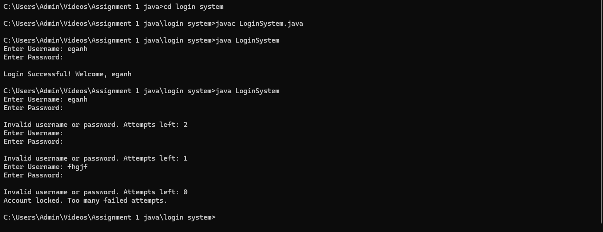

# Login System Project

## Overview

This project is a simple Login System developed to demonstrate user authentication. It allows users to login with a predefined username and password.

## Features

- User login with predefined credentials.
- Password input masking.
- Limited login attempts with account lockout after 3 failed attempts.

## How to Run

1. **Clone the repository**:
    ```sh
    git clone https://github.com/Egan-ombaka/Assignment-1-Java.git
    cd login-system
    ```

2. **Compile the Java files**:
    ```sh
    javac LoginSystem.java
    ```

3. **Run the LoginSystem class**:
    ```sh
    java LoginSystem
    ```

## Expected Output


## Author

- **Egan Ombaka**
- **REG NO**: BSE-01-0076/2024